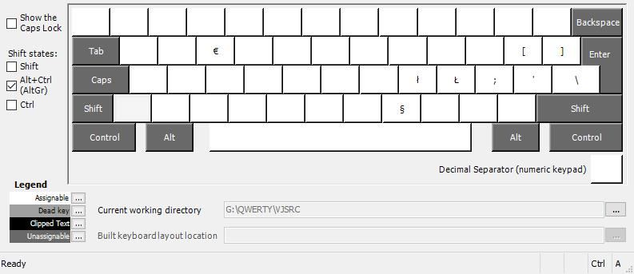
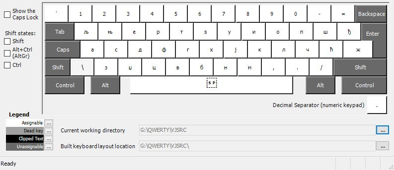
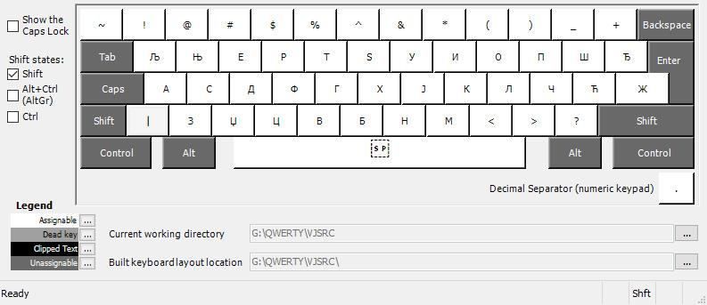
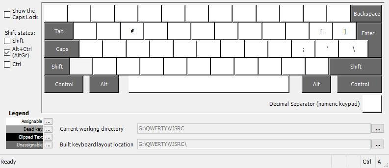

# Srpska latinica i ćirilica za US tastature
Ove rasporede sam napravio za osobe koje koriste tastature sa US rasporedom
slova i znakova. Konstantno prebacivanje između Z i Y, kao i različitog
rasporeda znakova, stvara česte greške u kucanju i često uzrokuje otežano učenje
slepog kucanja.

Sa ovim rasporedom tastera, raspored znakova je kao na engleskim (US)
tastaturama, a znakovi koji se nalaze ispod naših slova se aktiviraju
korišćenjem kombinacija `AltGr` i `Shift`

Novi rasporedi su napravljeni uz pomoć
[Microsoft Keyboard Layout Creator (MSKLC) Version 1.4 ](https://www.microsoft.com/en-us/download/details.aspx?id=102134)

## Latinica
Preuzmite [latiničnu instalaciju](./latinica/instalacija-latinica-us-raspored.zip)

### Osnovni raspored

### Shift

### AltGr (desni alt)

### Shift + AltGr (desni alt)

## Ćirilica
Preuzmite [ćiriličnu instalaciju](./cirilica/instalacija-cirilica-us-raspored.zip)

### Osnovni raspored

### Shift

### AltGr (desni alt)

### Shift + AltGr (desni alt)

## Poruka autora
Ove izmene svima dajem besplatno na korišćenje i ne tražim nikakve donacije zauzvrat.
Umesto toga bih vas zamolio da razmislite o donaciji KRIK-u, radi daljeg rasvetljavanja
korupcije i kriminala u Srbiji.

[Podrži KRIK!](https://vx.rs/krik)
